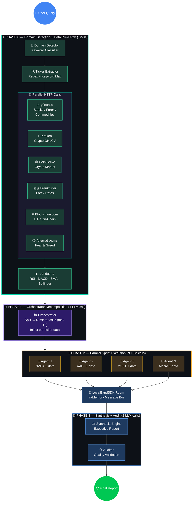
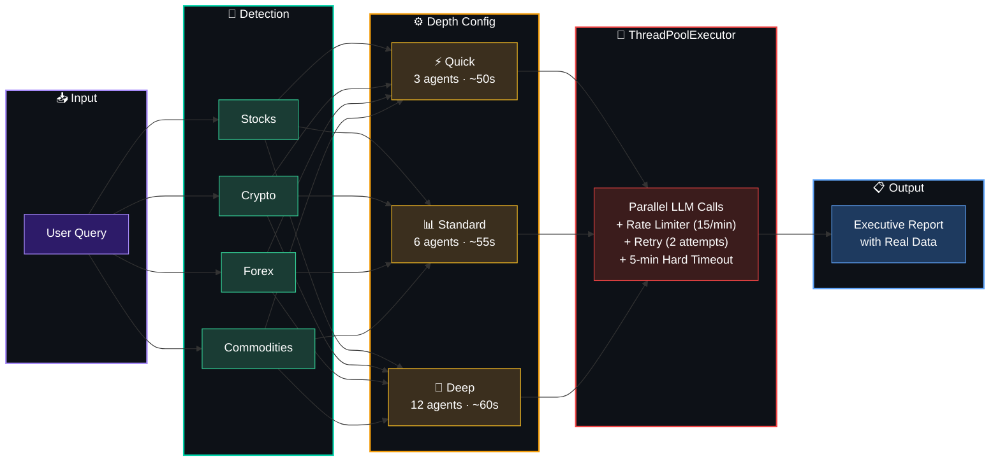
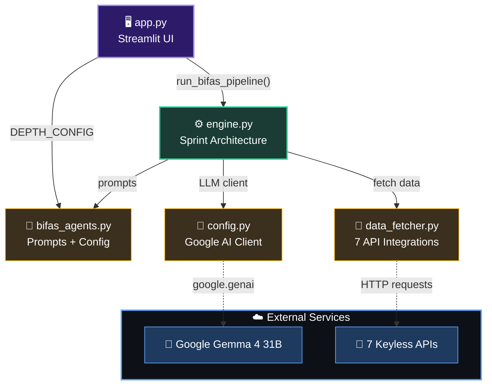

<div align="center">

# 📊 BIFAS

### Band Incorporated Finance Analytics System

**Multi-agent financial intelligence with Sprint Architecture — live market data, parallel execution, zero cost.**


<br/>

*A dynamic multi-agent system that decomposes financial queries into independent micro-tasks, fetches real-time market data from **7 keyless public APIs** (stocks, crypto, forex, commodities), executes analysis in parallel using specialized AI agents powered by **Google Gemma 4 31B**, and synthesizes results into executive-grade reports — all for **\$0**.*

</div>

---

## 🔑 Key Innovations

| | Innovation | Detail |
|---|-----------|--------|
| ⚡ | **Sprint Architecture** | Parallel agent execution — completes analysis in ~3-5 minutes |
| 📡 | **7 Keyless APIs** | Live market data — agents analyze real numbers, not hallucinations |
| 💸 | **100% Free** | Google AI free tier (Gemma 4 31B), no paid API keys required |
| 🎯 | **Auto Domain Detection** | Queries auto-classified as stocks / crypto / forex / commodities |
| 💉 | **Per-Ticker Injection** | Each agent sees only their assigned asset's real data |
| 📈 | **MVRV Approximation** | VWAP-based proxy with ~70% accuracy label for crypto valuations |
| 🛡️ | **Rate Limiter** | Built-in 15 req/min throttle respects free-tier API quotas |

---

## 🏗️ Architecture

### Sprint Pipeline Overview



### Agent Execution Model



### Module Dependency Graph



---

## 📡 Live Data Sources

> All data sources are **keyless** — no API keys, no sign-ups, no cost.

| Domain | Provider | Data | Freshness |
|--------|----------|------|-----------|
| **Stocks** | yfinance | Price, P/E, PEG, EPS, market cap, 52wk range, OHLCV | 15-min delayed |
| **Crypto OHLCV** | Kraken | BTC/ETH candles (real-time) | Real-time |
| **Crypto Market** | CoinGecko | Price, mcap, volume, supply, 24h change | ~60s cache |
| **Crypto On-Chain** | Blockchain.com | Hash rate, tx count, difficulty, active addresses | ~10min |
| **Crypto Sentiment** | Alternative.me | Fear & Greed Index (0-100) | Daily |
| **Forex OHLCV** | yfinance | EUR/USD, GBP/USD, USD/JPY candles | 15-min delayed |
| **Forex Rates** | Frankfurter | ECB rates, 30 currencies, historical from 1948 | Daily |
| **Commodities** | yfinance | Gold, Oil, Silver (GC=F, CL=F, SI=F) | 15-min delayed |
| **Technicals** | pandas-ta (local) | RSI, MACD, SMA(50/200), Bollinger Bands | Computed |
| **MVRV Approx** | CoinGecko + Blockchain.com | Price/1Y VWAP proxy (~70% accuracy) | Calculated |

---

## ✨ Features

| Feature | Description |
|---------|-------------|
| 📡 **Live Market Data** | Agents analyze real prices, not hallucinated numbers |
| 🎯 **Auto Domain Detection** | Query automatically classified as stocks/crypto/forex/commodities |
| 💉 **Per-Ticker Injection** | Each agent receives only their assigned asset's data |
| 🚀 **Parallel Execution** | All agents run simultaneously via `ThreadPoolExecutor` |
| ⏱️ **5-Minute Hard Timeout** | Pipeline never exceeds 300 seconds |
| 🧠 **Dynamic Task Decomposition** | Orchestrator splits queries into independent micro-tasks |
| 🔄 **Hybrid Agent Generation** | Mix of domain-based and asset-based agents |
| 🛡️ **Retry Logic** | Failed agents retry twice with `ServerError` backoff |
| 📊 **Partial Results** | Uses whatever agents complete before timeout |
| 📈 **MVRV Approximation** | VWAP-based proxy with ~70% accuracy label |

---

## 🛠️ Tech Stack

| Component | Technology |
|-----------|------------|
| **UI** | Streamlit |
| **LLM** | Google **Gemma 4 31B** (free tier, \$0) |
| **Stock/Forex/Commodity Data** | yfinance |
| **Crypto OHLCV** | Kraken API |
| **Crypto Market Data** | CoinGecko API |
| **BTC On-Chain** | Blockchain.com API |
| **Sentiment** | Alternative.me API |
| **Forex Rates** | Frankfurter API |
| **Technical Indicators** | pandas-ta |
| **Coordination** | LocalBandSDK (in-memory rooms) |
| **Parallelism** | ThreadPoolExecutor |
| **Language** | Python 3.10+ |
| **Config** | python-dotenv |

---

## 📁 Project Structure

```
BIFAS/
├── app.py                 # Streamlit UI — dark terminal aesthetic
├── engine.py              # Sprint architecture — orchestration, parallel execution, synthesis
├── bifas_agents.py        # Prompt templates + depth config (Quick/Standard/Deep)
├── data_fetcher.py        # 7 API integrations, domain detection, ticker extraction, technicals
├── config.py              # Google AI client initialization + env loader
├── requirements.txt       # Python dependencies
├── .env.example           # Environment variable template
├── .gitignore             # Ignored files
├── TEST_REPORT.md         # Test results summary (9/9 passed)
├── RAW_TEST_OUTPUT.md     # Full raw test output (9 runs)
└── README.md              # This file
```

---

## 🚀 Getting Started

### Prerequisites

- **Python 3.10+**
- A free **Google Gemini API key** — [Get one here](https://aistudio.google.com/apikey) (no credit card required)

> **That's it.** No other API keys needed — all 7 financial data sources are keyless public APIs.

### Installation

```bash
# Clone the repository
git clone https://github.com/p04pranav/BIFAS.git
cd BIFAS

# Install dependencies
pip install -r requirements.txt

# Set up environment
cp .env.example .env
# Edit .env and add your Google AI Studio API key
```

### Run

```bash
streamlit run app.py
```

---

## 🎮 Usage

1. **Launch** the app — opens a dark terminal-styled interface
2. **Select depth:**

   | Depth | Agents | Time | Best For |
   |-------|--------|------|----------|
   | ⚡ **Quick** | 3 | ~50s | Fast overviews |
   | 📊 **Standard** | 6 | ~55s | Balanced analysis |
   | 🔬 **Deep** | 12 | ~60s | Comprehensive research |

3. **Enter a query** — natural language, any financial domain
4. **Click** "Initialize BIFAS Sprint"
5. **Watch** agents execute in parallel with live data injection
6. **Review** the synthesized executive report with real market numbers

### Example Queries

```
📈 "Analyze NVDA, AAPL, MSFT stock outlook with technicals and valuation"
₿  "Bitcoin and Ethereum price trends, on-chain metrics, and sentiment"
💱 "EUR/USD, GBP/USD, USD/JPY forex correlations and macro factors"
🥇 "Gold and crude oil price analysis with dollar correlation"
```

---

## ⏱️ Pipeline Budget

| Depth | Agents | Phase 0 | Phase 1 | Phase 2 | Phase 3 | Phase 4 | Total LLM | Time |
|-------|--------|---------|---------|---------|---------|---------|-----------|------|
| ⚡ Quick | 3 | ~3s (data) | 1 LLM | 3 parallel | 1 LLM | 1 LLM | 6 + data | ~3 min |
| 📊 Standard | 6 | ~3s (data) | 1 LLM | 6 parallel | 1 LLM | 1 LLM | 9 + data | ~4 min |
| 🔬 Deep | 12 | ~3s (data) | 1 LLM | 12 parallel | 1 LLM | 1 LLM | 15 + data | ~5 min |

> ⏱️ Times include built-in rate limiting (15 req/min) to respect free-tier API quotas.

---

## ✅ Test Results

### v5.0 (Sprint + Live Data) — 9/9 PASSED

All 9 test configurations (3 domains × 3 depths) passed with live data using Google Gemma 4 31B.

| # | Domain | Depth | Agents | Time | Audit |
|---|--------|-------|--------|------|-------|
| 1-3 | 📈 Stocks | Quick / Standard / Deep | 3 / 6 / 12 | 52-81s | ✅ APPROVED |
| 4-6 | ₿ Crypto | Quick / Standard / Deep | 3 / 6 / 12 | 49-60s | ✅ APPROVED |
| 7-9 | 💱 Forex | Quick / Standard / Deep | 3 / 6 / 12 | 54-60s | ✅ APPROVED |

**Total Duration:** 528.6s (8.8 min) · **Average per Run:** 58.7s

### Data Accuracy: v4.0 → v5.0 → v6.0

| Metric | v4.0 (no data) | v5.0+ (live data) |
|--------|----------------|-------------------|
| Stock prices | ❌ Hallucinated | ✅ Real (consistent) |
| P/E, PEG, EPS | ❌ Guessed | ✅ Real (yfinance) |
| Technical indicators | ❌ None | ✅ Computed from real OHLCV |
| Crypto prices | ❌ Hallucinated | ✅ Real (Kraken/CoinGecko) |
| Fear & Greed | ❌ None | ✅ Real (Alternative.me) |
| On-chain metrics | ❌ None | ✅ Real (Blockchain.com) |
| MVRV ratio | ❌ None | ✅ Per-coin accurate |
| Forex rates | ❌ Guessed | ✅ Real (yfinance/Frankfurter) |
| Commodities | ❌ Hallucinated | ✅ Real prices |
| **API Cost** | — | **\$0 (free tier)** |

See [TEST_REPORT.md](TEST_REPORT.md) and [RAW_TEST_OUTPUT.md](RAW_TEST_OUTPUT.md) for full details.

---

## 📋 Changelog

### v5.1 — Resilience & Reliability

| Change | Description |
|--------|-------------|
| **Thought Part Handling** | `_extract_text()` handles Gemma 4's internal chain-of-thought parts |
| **ServerError Retry** | HTTP 500 handling with 10s backoff across all 4 pipeline phases |
| **JSON Truncation Fix** | `max_output_tokens` increased 2048 → 4096 for 12-agent arrays |
| **Agent Retry Count** | `RETRY_COUNT` increased 1 → 2 for better resilience |
| **Synthesis Robustness** | 3-attempt retry loop on `synthesize_report()` |
| **Analyses Buffer** | `analyses_text` limit 6000 → 12000 chars |
| **Parallelism** | `max_workers` increased 3 → 6 for Deep mode throughput |

### v6.0 — Google Gemma 4 31B Migration

Migrated from MiMo to Google Gemma 4 31B — same live data pipeline, **\$0 cost**.

---

## 🤝 Contributing

Contributions are welcome! Feel free to:

- 🐛 Report bugs via [GitHub Issues](https://github.com/p04pranav/BIFAS/issues)
- 🔀 Submit pull requests for new features
- 💡 Suggest new data sources or analysis domains

---

## 📄 License

Proprietary — All rights reserved.

---

## 👨‍💻 Credits

| Role | Contributor |
|------|-------------|
| **Finance Concepts & Research** | **Kushal H** |
| **Implementation & Testing** | **Pranav S** |

---

<div align="center">

**Built with precision by Pranav S & Kushal H**

[⬆ Back to Top](#-bifas)

</div>
