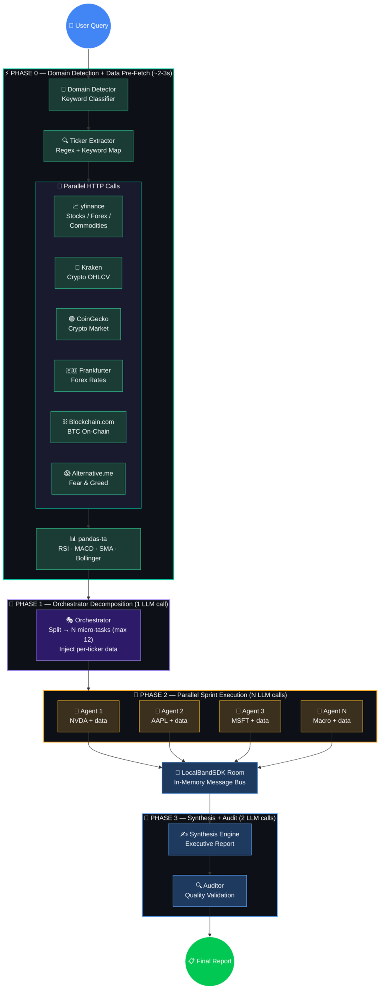
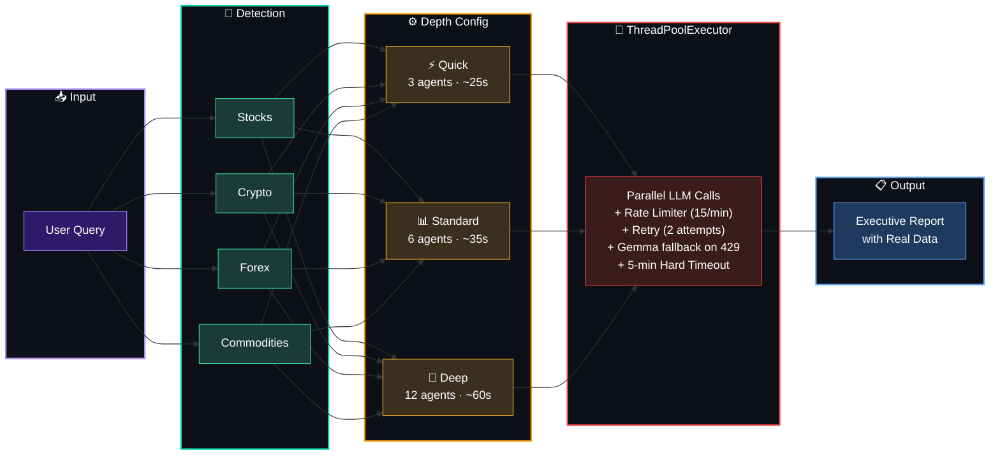
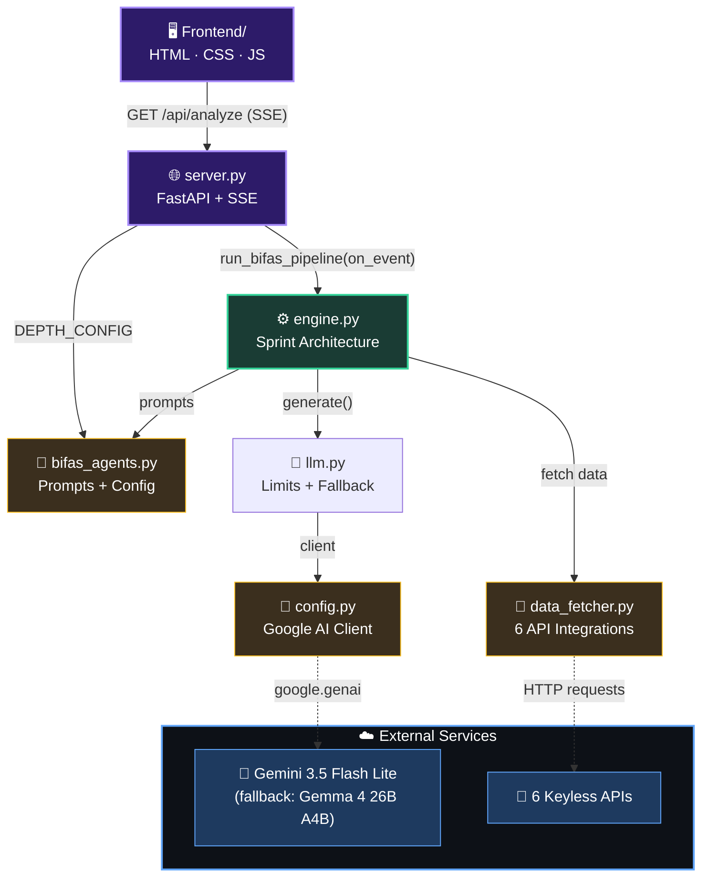
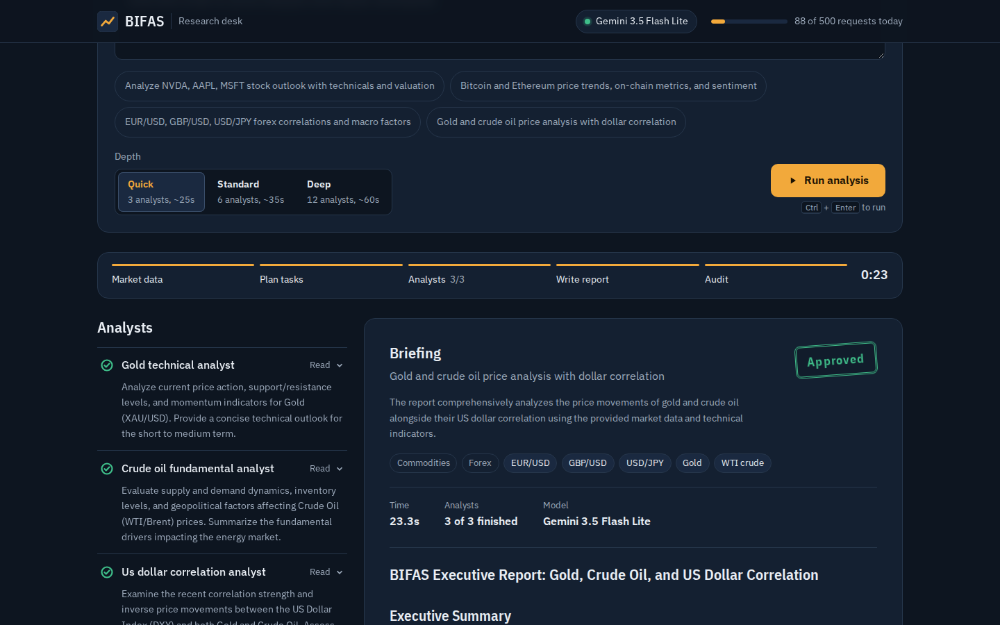

<div align="center">

# 📊 BIFAS

### Band Incorporated Finance Analytics System

**Multi-agent financial intelligence with Sprint Architecture — live market data, parallel execution, zero cost.**


<br/>

*A dynamic multi-agent system that decomposes financial queries into independent micro-tasks, fetches real-time market data from **6 keyless public APIs** (stocks, crypto, forex, commodities), computes technical indicators locally, executes analysis in parallel using specialized AI agents powered by **Google Gemini 3.5 Flash Lite** (with automatic Gemma 4 26B fallback), and synthesizes results into executive-grade reports — all for **\$0**.*

</div>

---

## 🔑 Key Innovations

| | Innovation | Detail |
|---|-----------|--------|
| ⚡ | **Sprint Architecture** | Parallel agent execution — completes analysis in ~3-5 minutes |
| 📡 | **6 Keyless APIs** | Live market data plus locally computed technicals — agents analyze real numbers, not hallucinations |
| 💸 | **100% Free** | Google AI free tier (Gemini 3.5 Flash Lite, Gemma 4 fallback), no paid API keys required |
| 🎯 | **Auto Domain Detection** | Queries auto-classified as stocks / crypto / forex / commodities |
| 💉 | **Per-Ticker Injection** | Each agent sees only their assigned asset's real data |
| 📈 | **MVRV Approximation** | VWAP-based proxy with ~70% accuracy label for crypto valuations |
| 🛡️ | **Quota Aware** | 15 req/min throttle + 500 req/day counter; switches to Gemma 4 26B when the daily quota runs out |
| 🧾 | **Structured Output** | Orchestrator tasks and audit verdicts come back as typed JSON — no regex scraping |

---

## 🏗️ Architecture

### Sprint Pipeline Overview


```mermaid
graph TB
    User(("👤 User Query"))

    subgraph Phase0["⚡ PHASE 0 — Domain Detection + Data Pre-Fetch (~2-3s)"]
        direction TB
        DD["🎯 Domain Detector<br/>Keyword Classifier"]
        TE["🔍 Ticker Extractor<br/>Regex + Keyword Map"]
        
        subgraph DataSources["📡 Parallel HTTP Calls"]
            direction LR
            YF["📈 yfinance<br/>Stocks / Forex /<br/>Commodities"]
            KR["🔷 Kraken<br/>Crypto OHLCV"]
            CG["🟢 CoinGecko<br/>Crypto Market"]
            FR["🇪🇺 Frankfurter<br/>Forex Rates"]
            BC["⛓️ Blockchain.com<br/>BTC On-Chain"]
            AM["😱 Alternative.me<br/>Fear & Greed"]
        end

        TA["📊 pandas-ta<br/>RSI · MACD · SMA · Bollinger"]
    end

    subgraph Phase1["🧠 PHASE 1 — Orchestrator Decomposition (1 LLM call)"]
        ORC["🎭 Orchestrator<br/>Split → N micro-tasks (max 12)<br/>Inject per-ticker data"]
    end

    subgraph Phase2["🚀 PHASE 2 — Parallel Sprint Execution (N LLM calls)"]
        direction LR
        A1["🤖 Agent 1<br/>NVDA + data"]
        A2["🤖 Agent 2<br/>AAPL + data"]
        A3["🤖 Agent 3<br/>MSFT + data"]
        AN["🤖 Agent N<br/>Macro + data"]
    end

    subgraph Phase3["📝 PHASE 3 — Synthesis + Audit (2 LLM calls)"]
        SYN["✍️ Synthesis Engine<br/>Executive Report"]
        AUD["🔍 Auditor<br/>Quality Validation"]
    end

    ROOM["💬 LocalBandSDK Room<br/>In-Memory Message Bus"]
    Report(("📋 Final Report"))

    User --> DD
    DD --> TE
    TE --> DataSources
    DataSources --> TA
    TA --> Phase1
    ORC --> Phase2
    A1 & A2 & A3 & AN --> ROOM
    ROOM --> SYN
    SYN --> AUD
    AUD --> Report

    style Phase0 fill:#0d1117,stroke:#00d4aa,stroke-width:2px,color:#fff
    style Phase1 fill:#0d1117,stroke:#a78bfa,stroke-width:2px,color:#fff
    style Phase2 fill:#0d1117,stroke:#f59e0b,stroke-width:2px,color:#fff
    style Phase3 fill:#0d1117,stroke:#60a5fa,stroke-width:2px,color:#fff
    style DataSources fill:#1a1a2e,stroke:#00d4aa,stroke-width:1px,color:#fff
    style User fill:#4285F4,stroke:#fff,stroke-width:2px,color:#fff
    style Report fill:#00C853,stroke:#fff,stroke-width:2px,color:#fff
    style ROOM fill:#1e3a5f,stroke:#60a5fa,stroke-width:1px,color:#fff
    style DD fill:#1a3c34,stroke:#34d399,stroke-width:1px,color:#fff
    style TE fill:#1a3c34,stroke:#34d399,stroke-width:1px,color:#fff
    style TA fill:#1a3c34,stroke:#34d399,stroke-width:1px,color:#fff
    style ORC fill:#2d1b69,stroke:#a78bfa,stroke-width:1px,color:#fff
    style A1 fill:#3b2f1e,stroke:#fbbf24,stroke-width:1px,color:#fff
    style A2 fill:#3b2f1e,stroke:#fbbf24,stroke-width:1px,color:#fff
    style A3 fill:#3b2f1e,stroke:#fbbf24,stroke-width:1px,color:#fff
    style AN fill:#3b2f1e,stroke:#fbbf24,stroke-width:1px,color:#fff
    style SYN fill:#1e3a5f,stroke:#60a5fa,stroke-width:1px,color:#fff
    style AUD fill:#1e3a5f,stroke:#60a5fa,stroke-width:1px,color:#fff
    style YF fill:#1a3c34,stroke:#34d399,stroke-width:1px,color:#fff
    style KR fill:#1a3c34,stroke:#34d399,stroke-width:1px,color:#fff
    style CG fill:#1a3c34,stroke:#34d399,stroke-width:1px,color:#fff
    style FR fill:#1a3c34,stroke:#34d399,stroke-width:1px,color:#fff
    style BC fill:#1a3c34,stroke:#34d399,stroke-width:1px,color:#fff
    style AM fill:#1a3c34,stroke:#34d399,stroke-width:1px,color:#fff
```

### Agent Execution Model


```mermaid
flowchart LR
    subgraph Input["📥 Input"]
        Q["User Query"]
    end

    subgraph Detection["🎯 Detection"]
        D1["Stocks"]
        D2["Crypto"]
        D3["Forex"]
        D4["Commodities"]
    end

    subgraph Depth["⚙️ Depth Config"]
        Quick["⚡ Quick<br/>3 agents · ~25s"]
        Standard["📊 Standard<br/>6 agents · ~35s"]
        Deep["🔬 Deep<br/>12 agents · ~60s"]
    end

    subgraph Execution["🚀 ThreadPoolExecutor"]
        P["Parallel LLM Calls<br/>+ Rate Limiter (15/min)<br/>+ Retry (2 attempts)<br/>+ Gemma fallback on 429<br/>+ 5-min Hard Timeout"]
    end

    subgraph Output["📋 Output"]
        R["Executive Report<br/>with Real Data"]
    end

    Q --> D1 & D2 & D3 & D4
    D1 & D2 & D3 & D4 --> Quick & Standard & Deep
    Quick & Standard & Deep --> P
    P --> R

    style Input fill:#0d1117,stroke:#a78bfa,stroke-width:2px,color:#fff
    style Detection fill:#0d1117,stroke:#00d4aa,stroke-width:2px,color:#fff
    style Depth fill:#0d1117,stroke:#f59e0b,stroke-width:2px,color:#fff
    style Execution fill:#0d1117,stroke:#ef4444,stroke-width:2px,color:#fff
    style Output fill:#0d1117,stroke:#60a5fa,stroke-width:2px,color:#fff
    style Q fill:#2d1b69,stroke:#a78bfa,stroke-width:1px,color:#fff
    style D1 fill:#1a3c34,stroke:#34d399,stroke-width:1px,color:#fff
    style D2 fill:#1a3c34,stroke:#34d399,stroke-width:1px,color:#fff
    style D3 fill:#1a3c34,stroke:#34d399,stroke-width:1px,color:#fff
    style D4 fill:#1a3c34,stroke:#34d399,stroke-width:1px,color:#fff
    style Quick fill:#3b2f1e,stroke:#fbbf24,stroke-width:1px,color:#fff
    style Standard fill:#3b2f1e,stroke:#fbbf24,stroke-width:1px,color:#fff
    style Deep fill:#3b2f1e,stroke:#fbbf24,stroke-width:1px,color:#fff
    style P fill:#3b1c1c,stroke:#ef4444,stroke-width:1px,color:#fff
    style R fill:#1e3a5f,stroke:#60a5fa,stroke-width:1px,color:#fff
```

### Module Dependency Graph


```mermaid
graph TD
    UI["🖥️ Frontend/<br/>HTML · CSS · JS"]
    APP["🌐 server.py<br/>FastAPI + SSE"]
    ENG["⚙️ engine.py<br/>Sprint Architecture"]
    AGT["🤖 bifas_agents.py<br/>Prompts + Config"]
    DAT["📡 data_fetcher.py<br/>6 API Integrations"]
    CFG["🔧 config.py<br/>Google AI Client"]

    UI -->|"GET /api/analyze (SSE)"| APP
    APP -->|"run_bifas_pipeline(on_event)"| ENG
    APP -->|"DEPTH_CONFIG"| AGT
    ENG -->|"prompts"| AGT
    ENG -->|"fetch data"| DAT
    ENG -->|"generate()"| LLM["🧭 llm.py<br/>Limits + Fallback"]
    LLM -->|"client"| CFG

    subgraph External["☁️ External Services"]
        GEMMA["🧠 Gemini 3.5 Flash Lite<br/>(fallback: Gemma 4 26B A4B)"]
        APIS["📡 6 Keyless APIs"]
    end

    CFG -.->|"google.genai"| GEMMA
    DAT -.->|"HTTP requests"| APIS

    style UI fill:#2d1b69,stroke:#a78bfa,stroke-width:2px,color:#fff
    style APP fill:#2d1b69,stroke:#a78bfa,stroke-width:2px,color:#fff
    style ENG fill:#1a3c34,stroke:#34d399,stroke-width:2px,color:#fff
    style AGT fill:#3b2f1e,stroke:#fbbf24,stroke-width:1px,color:#fff
    style DAT fill:#3b2f1e,stroke:#fbbf24,stroke-width:1px,color:#fff
    style CFG fill:#3b2f1e,stroke:#fbbf24,stroke-width:1px,color:#fff
    style External fill:#0d1117,stroke:#60a5fa,stroke-width:2px,color:#fff
    style GEMMA fill:#1e3a5f,stroke:#60a5fa,stroke-width:1px,color:#fff
    style APIS fill:#1e3a5f,stroke:#60a5fa,stroke-width:1px,color:#fff
```

---

## 📡 Live Data Sources

> All data sources are **keyless** — no API keys, no sign-ups, no cost.

| Domain | Provider | Data | Freshness |
|--------|----------|------|-----------|
| **Stocks** | yfinance | Price, P/E, PEG, EPS, market cap, 52wk range, OHLCV | 15-min delayed |
| **Crypto OHLCV** | Kraken | BTC/ETH candles (real-time) | Real-time |
| **Crypto Market** | CoinGecko | Price, mcap, volume, supply, 24h change | ~60s cache |
| **Crypto On-Chain** | Blockchain.com | Hash rate, tx count, difficulty, active addresses | ~10min |
| **Crypto Sentiment** | Alternative.me | Fear & Greed Index (0-100) | Daily |
| **Forex OHLCV** | yfinance | EUR/USD, GBP/USD, USD/JPY candles | 15-min delayed |
| **Forex Rates** | Frankfurter | ECB rates, 30 currencies, historical from 1948 | Daily |
| **Commodities** | yfinance | Gold, Oil, Silver (GC=F, CL=F, SI=F) | 15-min delayed |
| **Technicals** | pandas-ta (local) | RSI, MACD, SMA(50/200), Bollinger Bands | Computed |
| **MVRV Approx** | CoinGecko + Blockchain.com | Price/1Y VWAP proxy (~70% accuracy) | Calculated |

---

## ✨ Features

| Feature | Description |
|---------|-------------|
| 📡 **Live Market Data** | Agents analyze real prices, not hallucinated numbers |
| 🎯 **Auto Domain Detection** | Query automatically classified as stocks/crypto/forex/commodities |
| 💉 **Per-Ticker Injection** | Each agent receives only their assigned asset's data |
| 🚀 **Parallel Execution** | All agents run simultaneously via `ThreadPoolExecutor` |
| ⏱️ **5-Minute Hard Timeout** | Pipeline never exceeds 300 seconds |
| 🧠 **Dynamic Task Decomposition** | Orchestrator splits queries into independent micro-tasks |
| 🔄 **Hybrid Agent Generation** | Mix of domain-based and asset-based agents |
| 🛡️ **Retry Logic** | Failed agents retry twice with `ServerError` backoff |
| 📊 **Partial Results** | Uses whatever agents complete before timeout |
| 📈 **MVRV Approximation** | VWAP-based proxy with ~70% accuracy label |

---

## 🛠️ Tech Stack

| Component | Technology |
|-----------|------------|
| **Frontend** | Vanilla HTML / CSS / JS (marked + DOMPurify for markdown) |
| **API** | FastAPI + Server-Sent Events (uvicorn) |
| **LLM** | Google **Gemini 3.5 Flash Lite** (free tier, \$0) · fallback **Gemma 4 26B A4B** |
| **Stock/Forex/Commodity Data** | yfinance |
| **Crypto OHLCV** | Kraken API |
| **Crypto Market Data** | CoinGecko API |
| **BTC On-Chain** | Blockchain.com API |
| **Sentiment** | Alternative.me API |
| **Forex Rates** | Frankfurter API |
| **Technical Indicators** | pandas-ta |
| **Coordination** | LocalBandSDK (in-memory rooms) |
| **Parallelism** | ThreadPoolExecutor |
| **Language** | Python 3.10+ |
| **Config** | python-dotenv |
| **Structured Output** | Pydantic schemas |
| **Tests** | pytest (offline, mocked LLM, FastAPI TestClient) |

---

## 📁 Project Structure

```
BIFAS/
├── Backend/                   # Python: pipeline + HTTP API
│   ├── server.py              # FastAPI app — REST + live SSE stream, serves Frontend/
│   ├── engine.py              # Sprint architecture — orchestration, parallel execution, synthesis
│   ├── llm.py                 # Model calls — rate/daily limits, retries, Gemma fallback, structured output
│   ├── bifas_agents.py        # Prompt templates + depth config (Quick/Standard/Deep)
│   ├── data_fetcher.py        # API integrations, domain detection, ticker extraction, technicals
│   ├── config.py              # Google AI client, model names and limits from env
│   ├── tests/                 # Offline pytest suite (no API calls)
│   ├── requirements.txt       # Python dependencies
│   ├── requirements-dev.txt   # + pytest, httpx
│   └── .env.example           # Environment variable template
├── Frontend/                  # Static dashboard — no build step
│   ├── index.html
│   ├── styles.css             # Dark theme, desktop/laptop layout
│   └── app.js                 # Streams progress from the API and renders the briefing
├── docs/screenshot.png
├── TEST_REPORT.md             # Test results (v7.0 + historical v5/v6)
├── RAW_TEST_OUTPUT.md         # Full raw test output (v5 runs)
└── README.md
```

---

## 🚀 Getting Started

### Prerequisites

- **Python 3.10+**
- A free **Google Gemini API key** — [Get one here](https://aistudio.google.com/apikey) (no credit card required)

> **That's it.** No other API keys needed — all 6 market data sources are keyless public APIs, and technical indicators are computed locally.

### Installation

```bash
# Clone the repository
git clone https://github.com/p04pranav/BIFAS.git
cd BIFAS

# Install backend dependencies
cd Backend
pip install -r requirements.txt

# Set up environment
cp .env.example .env
# Edit .env and add your Google AI Studio API key
```

Optional settings in `Backend/.env`:

| Variable | Default | Purpose |
|----------|---------|---------|
| `BIFAS_MODEL` | `gemini-3.5-flash-lite` | Primary model |
| `BIFAS_FALLBACK_MODEL` | `gemma-4-26b-a4b-it` | Used when the primary's quota is exhausted |
| `BIFAS_RPM` | `15` | Requests per minute per model |
| `BIFAS_DAILY_LIMIT` | `500` | Primary-model requests per day (resets midnight Pacific) |
| `BIFAS_REQUEST_TIMEOUT_MS` | `90000` | Per-request HTTP timeout |
| `BIFAS_PORT` | `5050` | Port for `python server.py` |
| `BIFAS_CORS_ORIGINS` | `*` | Allowed origins if the frontend is hosted elsewhere |
| `BIFAS_MAX_CONCURRENT_RUNS` | `2` | Analyses allowed at once (protects the per-minute quota) |

### Run

```bash
cd Backend
uvicorn server:app --port 5050      # or: python server.py
```

Open **http://localhost:5050** — the backend serves the frontend too, so that one command runs everything.

To host `Frontend/` somewhere else, open it with `?api=http://your-backend:5050` (or set `window.BIFAS_API` in `index.html`) and set `BIFAS_CORS_ORIGINS` on the backend.

### API

| Endpoint | Description |
|----------|-------------|
| `GET /api/health` | `{"status": "ok"}` |
| `GET /api/meta` | Depth options, today's model usage, example queries |
| `GET /api/analyze?query=…&depth=Quick\|Standard\|Deep` | Runs an analysis and streams Server-Sent Events: `phase`, `data`, `tasks`, `agent`, `report`, `audit`, then `done` (full result) or `error`. Returns 422 for invalid input and 429 when too many analyses are running. |

```bash
curl -N "http://localhost:5050/api/analyze?query=Gold%20vs%20the%20dollar&depth=Quick"
```

### Tests

```bash
cd Backend
pip install -r requirements-dev.txt
pytest -q
```

---

## 🎮 Usage



1. **Open** http://localhost:5050 (designed for desktop and laptop screens)
2. **Select depth:**

   | Depth | Agents | Time | Best For |
   |-------|--------|------|----------|
   | ⚡ **Quick** | 3 | ~25s | Fast overviews |
   | 📊 **Standard** | 6 | ~35s | Balanced analysis |
   | 🔬 **Deep** | 12 | ~60s | Comprehensive research |

3. **Enter a query** — natural language, any financial domain
4. **Click** "Run analysis" (or press Ctrl + Enter)
5. **Watch** the progress timeline and each analyst finish in real time — expand any analyst to read their full notes
6. **Review** the briefing, stamped Approved or Rejected by the auditor, and copy or download it as Markdown

### Example Queries

```
📈 "Analyze NVDA, AAPL, MSFT stock outlook with technicals and valuation"
₿  "Bitcoin and Ethereum price trends, on-chain metrics, and sentiment"
💱 "EUR/USD, GBP/USD, USD/JPY forex correlations and macro factors"
🥇 "Gold and crude oil price analysis with dollar correlation"
```

---

## ⏱️ Pipeline Budget

| Depth | Agents | Phase 0 | Phase 1 | Phase 2 | Phase 3 | Phase 4 | Total LLM | Time |
|-------|--------|---------|---------|---------|---------|---------|-----------|------|
| ⚡ Quick | 3 | ~3s (data) | 1 LLM | 3 parallel | 1 LLM | 1 LLM | 6 + data | ~25s |
| 📊 Standard | 6 | ~3s (data) | 1 LLM | 6 parallel | 1 LLM | 1 LLM | 9 + data | ~35s |
| 🔬 Deep | 12 | ~3s (data) | 1 LLM | 12 parallel | 1 LLM | 1 LLM | 15 + data | ~60s |

> ⏱️ Times measured on Gemini 3.5 Flash Lite and include the 15 req/min rate limit. With the 500 req/day free quota that is roughly 80 Quick or 33 Deep runs per day before BIFAS switches to the (slower) Gemma 4 26B fallback. The pipeline always returns within 5 minutes.

---

## ✅ Test Results

### v7.0 (Gemini 3.5 Flash Lite)

**Offline:** 60/60 pytest tests pass (`cd Backend && pip install -r requirements-dev.txt && pytest -q`) — no API key or quota needed.

**Live:** 6/6 runs approved by the auditor, all on Flash Lite with no fallback or guardrails triggered.

| Domain | Depth | Agents | Time | Audit |
|--------|-------|--------|------|-------|
| 📈 Stocks | Quick | 3/3 | 23.0s | ✅ APPROVED |
| ₿ Crypto | Quick | 3/3 | 24.0s | ✅ APPROVED |
| 💱 Forex | Quick | 3/3 | 24.3s | ✅ APPROVED |
| 🥇 Gold + Oil | Quick | 3/3 | 23.7s | ✅ APPROVED |
| ₿ Crypto | Standard | 6/6 | 36.2s | ✅ APPROVED |
| 📈 Stocks | Deep | 12/12 | 61.2s | ✅ APPROVED |

### v5.0 (Sprint + Live Data) — 9/9 PASSED

All 9 test configurations (3 domains × 3 depths) passed with live data using MiMo-V2.5, the model BIFAS used at the time (see [RAW_TEST_OUTPUT.md](RAW_TEST_OUTPUT.md)).

| # | Domain | Depth | Agents | Time | Audit |
|---|--------|-------|--------|------|-------|
| 1-3 | 📈 Stocks | Quick / Standard / Deep | 3 / 6 / 12 | 52-81s | ✅ APPROVED |
| 4-6 | ₿ Crypto | Quick / Standard / Deep | 3 / 6 / 12 | 49-60s | ✅ APPROVED |
| 7-9 | 💱 Forex | Quick / Standard / Deep | 3 / 6 / 12 | 54-60s | ✅ APPROVED |

**Total Duration:** 528.6s (8.8 min) · **Average per Run:** 58.7s

### Data Accuracy: v4.0 → v5.0 → v6.0

| Metric | v4.0 (no data) | v5.0+ (live data) |
|--------|----------------|-------------------|
| Stock prices | ❌ Hallucinated | ✅ Real (consistent) |
| P/E, PEG, EPS | ❌ Guessed | ✅ Real (yfinance) |
| Technical indicators | ❌ None | ✅ Computed from real OHLCV |
| Crypto prices | ❌ Hallucinated | ✅ Real (Kraken/CoinGecko) |
| Fear & Greed | ❌ None | ✅ Real (Alternative.me) |
| On-chain metrics | ❌ None | ✅ Real (Blockchain.com) |
| MVRV ratio | ❌ None | ✅ Per-coin accurate |
| Forex rates | ❌ Guessed | ✅ Real (yfinance/Frankfurter) |
| Commodities | ❌ Hallucinated | ✅ Real prices |
| **API Cost** | — | **\$0 (free tier)** |

See [TEST_REPORT.md](TEST_REPORT.md) and [RAW_TEST_OUTPUT.md](RAW_TEST_OUTPUT.md) for full details.

---

## 📋 Changelog

### v7.1 — Backend / Frontend Split

| Change | Description |
|--------|-------------|
| **Backend/** | Pipeline, tests and config moved under `Backend/`; new FastAPI server with a live SSE progress stream |
| **Frontend/** | New dark HTML/CSS/JS research-desk dashboard replaces Streamlit — live analyst progress, audit stamp, correctly rendered `$` amounts, copy/download |
| **Streamlit removed** | `app.py` and the `streamlit` dependency are gone |

### v7.0 — Gemini 3.5 Flash Lite + Reliability Fixes

| Change | Description |
|--------|-------------|
| **New Primary Model** | Gemini 3.5 Flash Lite — ~25s Quick runs (was ~6 min on Gemma) |
| **Gemma Fallback** | Automatic switch to Gemma 4 26B A4B on 429 / daily quota exhaustion, shown in the UI |
| **Quota Tracking** | 15 RPM limiter per model + persisted 500/day counter |
| **Auditor Fix** | Typed APPROVED/REJECTED verdict on the full report (was leaking model reasoning) |
| **Real Hard Timeout** | Stuck agents are abandoned; runs always return within 300s |
| **Domain Detection** | Whole-word matching ('v', 'eth', 'sol' no longer match inside words) |
| **Commodity Data** | Gold/oil/etc. agents now receive their own price and technicals |
| **Indicator Fix** | MACD signal/histogram and Bollinger upper/lower were swapped |
| **UI** | Report rendered as markdown, full agent output, model + quota display |
| **Tests** | 60 offline pytest tests (mocked LLM + API server) |

### v5.1 — Resilience & Reliability

| Change | Description |
|--------|-------------|
| **Thought Part Handling** | `_extract_text()` handles Gemma 4's internal chain-of-thought parts |
| **ServerError Retry** | HTTP 500 handling with 10s backoff across all 4 pipeline phases |
| **JSON Truncation Fix** | `max_output_tokens` increased 2048 → 4096 for 12-agent arrays |
| **Agent Retry Count** | `RETRY_COUNT` increased 1 → 2 for better resilience |
| **Synthesis Robustness** | 3-attempt retry loop on `synthesize_report()` |
| **Analyses Buffer** | `analyses_text` limit 6000 → 12000 chars |
| **Parallelism** | `max_workers` increased 3 → 6 for Deep mode throughput |

### v6.0 — Google Gemma 4 31B Migration

Migrated from MiMo to Google Gemma 4 31B — same live data pipeline, **\$0 cost**.

---

## 🤝 Contributing

Contributions are welcome! Feel free to:

- 🐛 Report bugs via [GitHub Issues](https://github.com/p04pranav/BIFAS/issues)
- 🔀 Submit pull requests for new features
- 💡 Suggest new data sources or analysis domains

---

## 📄 License

Proprietary — All rights reserved.

---

## 👨‍💻 Credits

| Role | Contributor |
|------|-------------|
| **Finance Concepts & Research** | **Kushal H** |
| **Implementation & Testing** | **Pranav S** |

---

<div align="center">

**Built with precision by Pranav S & Kushal H**

[⬆ Back to Top](#-bifas)

</div>
